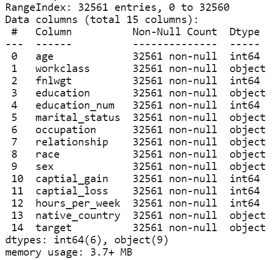
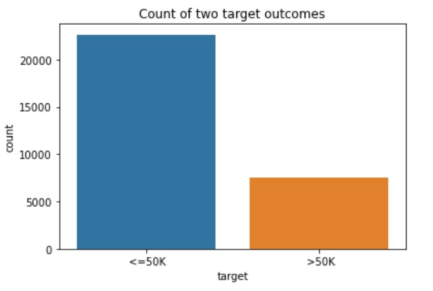
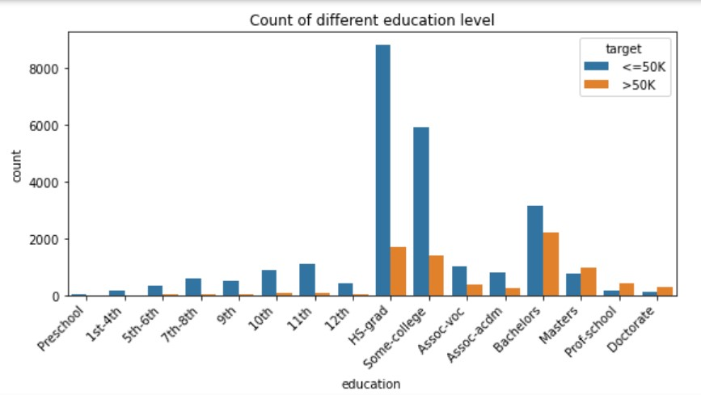
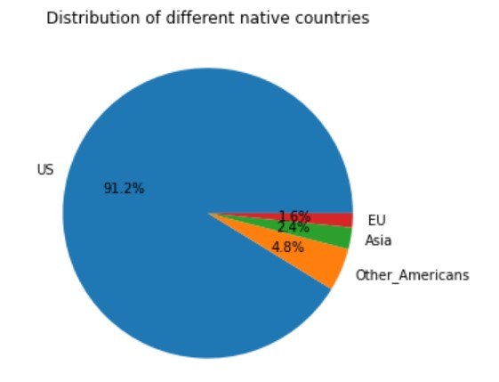
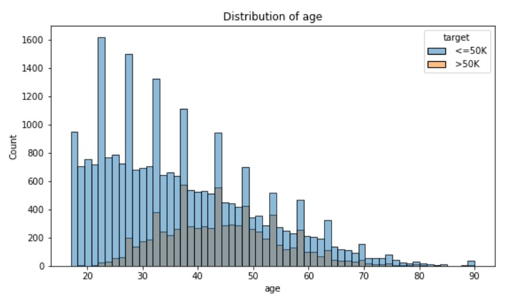
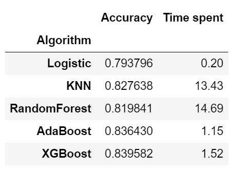
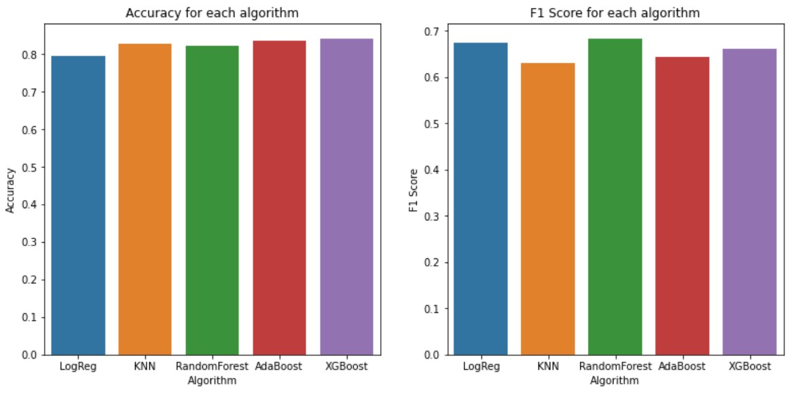
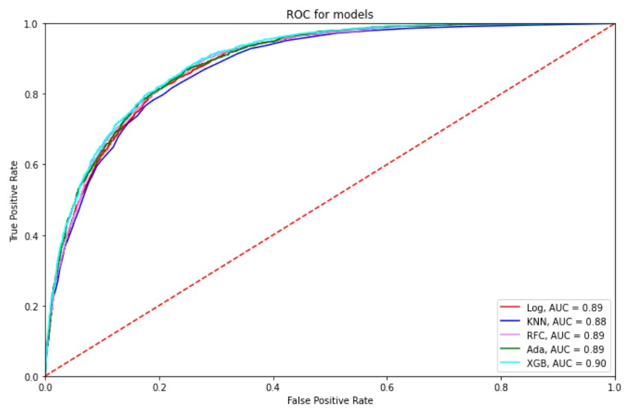

# Census Income Classification

### Data Source
[UCL Machine Learning Repository - Census Income Data Set](http://archive.ics.uci.edu/ml/datasets/Census+Income)

### Objective
Build machine learning models to predict whether income exceeds $50K/yr based on census data.   

### Data set overview

### Data Cleaning and Feature engineering
- Removing duplicated entries
- Removing unknown data
- native_country: grouping 42 categories into 4 
- Droping some columns to avoid multicollinearity

### Some visualizations

### Feature pre-processing
- One-hot encoding
- Standard scaling

### Machine Learning models used
- Logistic Regression
- KNN
- Random Forest
- AdaBoost
- XGBoost

### Comparison of models' performances

The best results are highlighted.
 

The 5 models has similar performance. XGBoost has the highest accuracy and ROC. Random Forest has the highest F1 score, but it is slightly overfitting (refer to the code for details). 

Since the target of the dataset is not very imbalanced (about 3:1), accuracy is also acceptable for evaluating the model performance. In terms of the three evaluation metrics, as well as the time spent on model training, XGBoost will be the best model for the classification.

### Conclusion
- Model used: XGBoost
- Accuracy: 0.840
- F1 Score: 0.660
- ROC-AUC: 0.90

### Skills Acquired
- Data manipulation by Pandas
- Feature engineering
- Machine Learning model building
- Hyperparameter tuning
- Model evaluation
